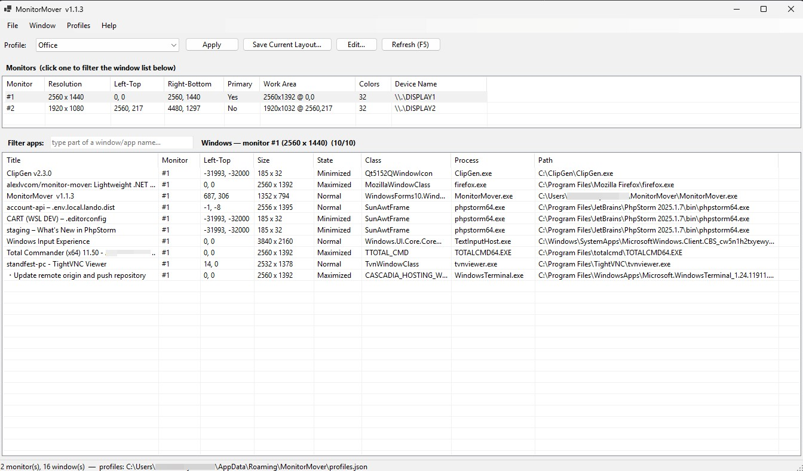

# MonitorMover

A lightweight .NET (WinForms) utility inspired by NirSoft's **MultiMonitorTool**.
It does the two things you actually need — plus the feature MultiMonitorTool lacks:

1. **Detect monitors** — lists every display with resolution, position, primary flag, work area, and device name.
2. **Move a window between monitors** — select any app window and send it to the next monitor, the primary monitor, or a specific monitor.
3. **Layout profiles (the new feature)** — save your current window arrangement as a named profile (e.g. **Home**, **Office**) and re-apply it in one click. No more dragging every app back to the right screen each morning when your monitor setup changes.



## When you need this

Windows is notoriously bad at remembering where your windows belong when the display setup changes. MonitorMover is for the moments it gets it wrong:

- **Switching between home and work.** Your desk at the office and your desk at home have different monitor counts, resolutions, or arrangements. Plug in at either place and Windows scatters your apps onto whatever screen it likes. Save a **Home** profile and an **Office** profile once, then apply the right one when you sit down and every app snaps back to its correct screen, position, size, and state.
- **On a single PC, after a monitor was disconnected/reconnected.** Undocking a laptop, a monitor going to sleep, waking from standby, or a cable getting bumped makes Windows collapse everything onto one screen or pile windows up misaligned. Instead of dragging each app back by hand, apply your profile and the layout is repaired in one click.
- **Ad-hoc, without profiles at all.** You just want *this one window* on the other monitor — select it and send it to the next / primary / a specific monitor (F8 / F7).

## Why profiles

At the office and at home you have different monitor configurations, so Windows dumps your apps onto whatever screen it likes. Instead of manually moving each app every day:

- Arrange your windows once at each location.
- Save a profile there (**Office**, **Home**, …).
- Each day, pick the matching profile and hit **Apply** — every listed app jumps to its correct monitor, position, size, and state (normal / maximized).

Profiles are keyed to the monitor layout at capture time and matched back by device name → monitor index → nearest resolution, so they survive small changes.

## Build

```
cd MonitorMover
dotnet build -c Release
```

Output: `bin\Release\net8.0-windows\MonitorMover.exe` (self-contained to the .NET 8 runtime).

## Use (GUI)

Run `MonitorMover.exe`. Top panel = monitors, bottom panel = windows.

- **Filter by monitor:** click a monitor in the top pane to show only that monitor's windows below; right-click a monitor → *Show Windows On All Monitors* to clear the filter.
- **Move a window:** right-click it → *Move To Next / Primary / specific Monitor* (or F8 / F7).
- **Save a layout:** *Profiles → Save Current Layout as Profile…* — captures all open app windows, then lets you prune/edit the list before saving.
- **Add just a few apps:** select windows → right-click → *Add Selected to Profile…*.
- **Edit a profile:** pick it in the Profile dropdown → *Edit…* — toggle rows on/off, refine the title match, change target monitor or state.
- **Apply:** pick a profile in the dropdown → **Apply**.

## Use (command line / scripting)

Handy for a login shortcut or scheduled task:

```
MonitorMover.exe --list                 List saved profiles
MonitorMover.exe --capture "Office"     Capture current layout as "Office" (headless)
MonitorMover.exe --apply   "Office"     Apply the "Office" profile (headless; pops a report only if something was skipped)
MonitorMover.exe --dump [file]          Diagnostic dump of detected monitors + windows
```

**Tip — one-click Home/Office:** make two desktop shortcuts:
- `MonitorMover.exe --apply "Home"`
- `MonitorMover.exe --apply "Office"`

Double-click the right one when you sit down.

## Where profiles live

`%APPDATA%\MonitorMover\profiles.json` (human-readable; edit or back it up freely).
*File → Open Profiles Folder* jumps there.

## Notes / limits

- To move windows belonging to **elevated** apps, run MonitorMover as administrator.
- Matching is by process name (+ optional title substring). If you run two windows of the same app, add a *Title Contains* filter to target each one.
- Minimized/maximized windows capture their **restore** position, so they land correctly when reopened.
