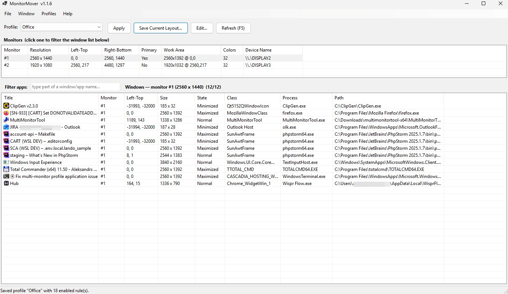

# MonitorMover

A lightweight .NET (WinForms) utility inspired by NirSoft's **MultiMonitorTool**.
It does the two things you actually need — plus the features MultiMonitorTool lacks:

1. **Detect monitors** — lists every display with resolution, position, primary flag, work area, and device name.
2. **Move a window between monitors** — select any app window and send it to the next monitor, the primary monitor, or a specific monitor.
3. **Layout profiles** — save your current window arrangement as a named profile (e.g. **Home**, **Office**) and re-apply it in one click. No more dragging every app back to the right screen each morning when your monitor setup changes.
4. **Search / filter apps by keyword** — no more scanning a long window list to find the one you want. Type any keyword in the **Filter apps** box and the list instantly narrows to every window whose title *or* process name contains it. Pick and move your app in a second.



## Download

Grab the latest **MonitorMover.exe** from the [Releases page](https://github.com/alexlvcom/monitor-mover/releases/latest) — or directly:

**https://github.com/alexlvcom/monitor-mover/releases/latest/download/MonitorMover.exe**

It's a single, self-contained executable — **no .NET runtime install needed**. Just download and double-click.

### First run: Windows SmartScreen

The exe is **unsigned** (I'm not paying for a code-signing certificate for a free hobby tool), so Windows may show **"Windows protected your PC."** This is *not* a virus warning — it only means the file is new and hasn't built up download reputation yet. Click **More info → Run anyway**.

Prefer to be sure? The source is right here — [build it yourself](#build).

### Verify your download (optional)

Each release lists the SHA-256 of the exe. To check the file you downloaded matches:

```powershell
Get-FileHash .\MonitorMover.exe -Algorithm SHA256
```

Compare the output against the hash shown on that version's [release page](https://github.com/alexlvcom/monitor-mover/releases/latest).

## When you need this

Windows is notoriously bad at remembering where your windows belong when the display setup changes. MonitorMover is for the moments it gets it wrong:

- **Switching between home and work.** Your desk at the office and your desk at home have different monitor counts, resolutions, or arrangements. Plug in at either place and Windows scatters your apps onto whatever screen it likes. Save a **Home** profile and an **Office** profile once, then apply the right one when you sit down and every app snaps back to its correct screen, position, size, and state.
- **On a single PC, after a monitor was disconnected/reconnected.** Undocking a laptop, a monitor going to sleep, waking from standby, or a cable getting bumped makes Windows collapse everything onto one screen or pile windows up misaligned. Instead of dragging each app back by hand, apply your profile and the layout is repaired in one click.
- **Ad-hoc, without profiles at all.** You just want *this one window* on the other monitor — select it and send it to the next / primary / a specific monitor (F8 / F7).

## Why profiles

At the office and at home you have different monitor configurations, so Windows dumps your apps onto whatever screen it likes. Instead of manually moving each app every day:

- Arrange your windows once at each location.
- Save a profile there (**Office**, **Home**, …).
- Each day, pick the matching profile and hit **Apply** — every listed app jumps to its correct monitor, position, size, and state (normal / maximized).

Profiles are keyed to the monitor layout at capture time and matched back on a series of signals, each only breaking ties left by the one before it: **resolution**, then **desktop-layout position**, then the **primary flag**, and only as a last resort the device name and monitor index. Position is what tells two monitors of the *same* resolution apart — the primary monitor's top-left is always `0,0` and every other screen keeps the offset you arranged in Display Settings. Together this survives Windows reassigning display device names when monitors are unplugged and reconnected, so applying a profile after a re-dock still sends each window to the right screen.

Monitors are numbered by that same layout — **#1 is always the monitor at `0,0`**, then left-to-right — rather than by the device enumeration order Windows reshuffles on re-dock.

## Build

```
cd MonitorMover
dotnet publish -c Release -r win-x64 --self-contained true -p:PublishSingleFile=true -o publish
```

Output: `publish\MonitorMover.exe` (single-file, self-contained Windows x64 executable).

## Use (GUI)

Run `MonitorMover.exe`. Top panel = monitors, bottom panel = windows.

- **Find an app by keyword:** type into the **Filter apps** box to instantly narrow the list to windows whose title or process name contains what you typed — much faster than eyeballing a long list. Clear the box to show everything again.
- **Filter by monitor:** click a monitor in the top pane to show only that monitor's windows below; right-click a monitor → *Show Windows On All Monitors* to clear the filter.
- **Move a window:** right-click it → *Move To Next / Primary / specific Monitor* (or F8 / F7).
- **Update the selected layout:** click **Save Current Layout…** (or use *Profiles → Save Current Layout to Selected Profile…*) to recapture the currently selected profile without asking for another name.
- **Save a new layout:** *Profiles → Save Current Layout as New Profile…* — captures all open app windows under a new name, then lets you prune/edit the list before saving.
- **Add just a few apps:** select windows → right-click → *Add Selected to Profile…*.
- **Edit a profile:** pick it in the Profile dropdown → *Edit…* — toggle rows on/off, refine the title match, change target monitor or state.
- **Delete a profile:** pick it in the Profile dropdown → **Delete…**, then confirm.
- **Apply:** pick a profile in the dropdown → **Apply**.

## Use (command line / scripting)

Handy for a login shortcut or scheduled task:

```
MonitorMover.exe --list                 List saved profiles
MonitorMover.exe --capture "Office"     Capture current layout as "Office" (headless)
MonitorMover.exe --apply   "Office"     Apply the "Office" profile (headless; pops a report only if something was skipped)
MonitorMover.exe --dump [file]          Diagnostic dump of detected monitors + windows
```

**Tip — one-click Home/Office:** make two desktop shortcuts:
- `MonitorMover.exe --apply "Home"`
- `MonitorMover.exe --apply "Office"`

Double-click the right one when you sit down.

## Where profiles live

`%APPDATA%\MonitorMover\profiles.json` (human-readable; edit or back it up freely).
*File → Open Profiles Folder* jumps there.

## Notes / limits

- To move windows belonging to **elevated** apps, run MonitorMover as administrator.
- Matching is by process name (+ optional title substring). If you run two windows of the same app, add a *Title Contains* filter to target each one.
- Minimized/maximized windows capture their **restore** position, so they land correctly when reopened.
